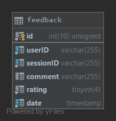

# Feedback Service
[](https://travis-ci.org/Piszmog/feedback-service)
[](https://coveralls.io/github/Piszmog/feedback-service?branch=master)
[](https://goreportcard.com/report/github.com/Piszmog/feedback-service)
[](https://github.com/Piszmog/feedback-service/releases/latest)
[](https://opensource.org/licenses/MIT)

## Building
There are a few ways to build the application. Each way will create binaries for Linux, OSX, and Windows.

### Windows Script
A `build.bat` file is provided.

#### Building
Run the script to execute tests and build the binaries,
e.g. `buid.bat`

### Shell Script
A `build.sh` file is provided.

#### Building
Run the script to execute tests and build the binaries,
e.g. `./build.sh`

### Makefile
A `makefile` file is provided.

### Building
The make file allows for `build`, `clean`, `test` or `all`
e.g. `make all`

## Running
The following is how to run the application,

### Prerequisites
Ensure a MySQL is available to connect to along with a username and a password to the user used to connect to the database.
* The default database to connect to is `ubisoft`. This can be overridden by setting the environment variable `DB_DATABASE`

The following are the required environment variables needed to be set for the application,
* `DB_USERNAME` - the user that has access to the MySQL DB
* `DB_PASSWORD` - the password to the DB user

#### Optional Environment Variables
There are additional environment variable that can be set to override additional defaults
* `HOST` - the host to run the web application on. Defaults to `localhost`
* `PORT` - the port to run the web application on. Defaults to `8080`
* `DB_DATABASE` - the name of the database to connect to and create the `feedback` table in. Defaults to `ubisoft`
* `DB_HOST` - the host of the MySQL DB. Defaults to `localhost`
* `DB_PORT` - the port of the MySQL DB. Defaults to `3306`

### Starting
Run the application by starting the built binary.

The binary can be created by following the above steps to build or by going to the __Releases__ page and downloading the 
latest binary.

e.g. `./feedback-service-mac`

###### Example Logs
```text
2019/11/13 16:54:18 Starting application...
2019/11/13 16:54:18 Defaulting to default DB host name 'localhost'
2019/11/13 16:54:18 Defaulting to default DB port '3306'
2019/11/13 16:54:18 Defaulting to default database name 'ubisoft'
2019/11/13 16:54:18 Successfully connected to ubisoft database
2019/11/13 16:54:18 Defaulting to default HTTP host 'localhost'
2019/11/13 16:54:18 Defaulting to default HTTP port '8080'
2019/11/13 16:54:18 Application started in 0.011936 seconds
2019/11/13 16:54:18 Running on localhost:8080 with PID 9632
```

## Database
The database used for the application is a [MySQL](https://dev.mysql.com/downloads/installer/) DB.

When the application starts, it will look for an environment variable `DB_DATABASE`. If not present, the default database 
`ubisoft` will be used.

### Table
The following is the `feedback` table used by the application.

At startup, if the table does not exist, the application will create the table.



#### SQL Command
The following is the SQL command to create the table with the necessary indexes.

```sql
create table feedback
(
    id        int unsigned auto_increment
        primary key,
    userID    varchar(255) not null,
    sessionID varchar(255) not null,
    comment   varchar(255) null,
    rating    tinyint      not null,
    date      timestamp    not null
);

create index sessionID
    on feedback (sessionID asc, date desc);

create index userID
    on feedback (userID, sessionID);
```

#### Queries
The following are the different queries ran against the `feedback` table,

```sql
SELECT EXISTS(SELECT * FROM feedback WHERE userID=? AND sessionID=?);

INSERT INTO feedback(`userID`, `sessionID`, `comment`, `rating`, `date`) VALUES (?,?,?,?,?);

SELECT * FROM feedback where sessionID=? ORDER BY `date` DESC LIMIT 15;

SELECT * FROM feedback where sessionID=? AND rating=? ORDER BY `date` DESC LIMIT 15;
```

## APIs
A [Swagger Spec](swagger.yml) is available REST APIs. The Spec can be copied into the [Swagger Editor](http://editor.swagger.io/) 
to view the Spec fully rendered.

### Insert Feedback
A User can provide feedback for a Session via the following API,

||||
|---|---|---|
| Method | POST ||
| Path | `/{sessionID}` | `sessionID` is the ID of the Session the User is providing feedback for |
| Header | `Ubi-UserId` | Is the ID of the User that is providing the feedback |
|Return Codes| `200` - Success<br/>`400` - Missing header or bad request payload<br/>`409` - User already submitted feedback<br/>`500` - Server Error||

##### Request Body
```json
{
  "comment": "{a general comment a User can leave}",
  "rating": #
}
```
Where,
* `rating` is a number between 1-5

##### Response Body
A response body is only returned when a status code other than `200` is returned.

Format:
```json
{
  "code": ###,
  "reason": "{a reason for the code}"
}
```

###### Example
* Method: `POST`
* Path: `/1234`
* Headers:
  * `Ubi-UserId=987`
* Request Body:
```json
{
  "comment": "Best session I ever had!",
  "rating": 5
}
```

### Retrieve Feedback
Operations can retrieve the last 15 most recent feedbacks for a Session via the following API,

||||
|---|---|---|
| Method | GET ||
| Path | `/{sessionID}` | `sessionID` is the ID of the Session the User is providing feedback for |
|Return Codes| `200` - Success<br/>`500` - Server Error||

##### Response Body
Different response bodies are returned based on the status code returned by the server.

##### HTTP 200
```json
[
  {
    "id": ###,
    "userId": "{the User ID}",
    "sessionId": "{the Session ID}",
    "comment": "{the comment left by the user for the session}",
    "rating": #,
    "date": "yyyy-MM-ddThh:mm:ssZ"
  }
]
```

##### HTTP 500
```json
{
  "code": ###,
  "reason": "{a reason for the code}"
}
```

###### Example
* Method: `GET`
* Path: `/1234567`
* Request Body:
```json
[
  {
    "id": 1,
    "userId": "98765432",
    "sessionId": "1234567",
    "comment": "This is a test",
    "rating": 3,
    "date": "2019-11-13T04:44:01Z"
  }
]
```
